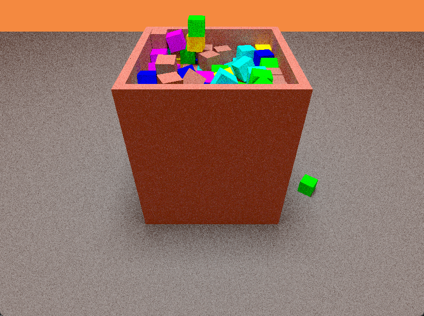

# beat-box

Real-time **GPU rigid-body physics** + **hardware ray tracing**, in one Vulkan app. The simulation
(broad phase, SAT narrow phase, constraint solving) and the path-traced renderer both run on the
GPU, built on [Daxa](https://github.com/Ipotrick/Daxa) task graphs with shaders written in
[Slang](https://github.com/shader-slang/slang).



## Features

- **Four GPU constraint solvers**, switchable at runtime:
  **AVBD** (Augmented Vertex Block Descent — per-body 6×6 block descent + augmented Lagrangian, the
  default), PGS, PGS soft-constraints, and TGS soft (Box2D-v3-style sub-stepped relax).
- **GPU collision pipeline**: morton-code radix sort → LBVH broad phase → SAT narrow phase with
  persistent manifolds and warm starting, plus **voxelized concave colliders**.
- **Graph-coloring parallelization** of the contact/body graph so constraint blocks solve in
  parallel without races (press `G` to visualize the coloring).
- **Path-traced renderer** over the hardware ray-tracing pipeline: emissive area lights with
  next-event estimation + MIS, progressive accumulation mode, debug views (normals, contacts,
  simulation islands).
- **8 built-in scenes** (`F1`–`F8`) + **data-driven text scenes** (`BB_SCENE_FILE`) that load
  without recompiling.
- **Headless measurement harness**: per-step ground-truth metrics to CSV, pass/fail threshold
  asserts for CI-style regression gates, and a determinism checker — see
  [docs/TESTING.md](docs/TESTING.md).

## Requirements

- Windows 10/11 with **Visual Studio 2022** (the `Release` CMake preset uses the VS 17 generator;
  `Release-Linux`/Ninja presets exist but Windows is the primary tested path)
- **CMake ≥ 3.21** and **Git** (the configure step clones Daxa and vcpkg automatically)
- **Vulkan SDK** installed (validation layers only needed for debugging)
- A GPU + driver with **Vulkan ray-tracing pipeline** support (`VK_KHR_ray_tracing_pipeline`)

## Build

```sh
# 1) Configure (first run: clones Daxa 3.6 + applies patches/daxa-3.6, bootstraps vcpkg deps)
cmake --preset Release

# 2) Build
cmake --build build/Release --config RelWithDebInfo

# 3) (Optional) pre-warm the shader cache as a build step — otherwise the FIRST launch
#    compiles all Slang pipelines (~100 s, one time); later launches start in ~2 s.
cmake --build build/Release --config RelWithDebInfo --target warm_shader_cache

# Run
build/Release/RelWithDebInfo/beat-box.exe
```

> The console prints `[COMPILE N] <pipeline>` progress during a cold shader compile — it is not a
> hang. The SPIR-V cache lives in `spirv_cache/` next to the executable.

## Controls

| Key | Action |
|---|---|
| `Space` | start / pause the simulation |
| `R` | reset the current scene |
| `F1`–`F8` | switch scene (resets + pauses) |
| `1` / `2` / `3` / `4` | solver: PGS / PGS soft / **AVBD** / TGS soft |
| `W A S D` / arrows | move camera (hold `Shift` for precision) |
| `X` / `Z` | camera up / down |
| `Tab` | toggle the ImGui overlay |
| `0` | toggle progressive accumulation |
| `7` / `8` / `9` | debug view: contacts / normals / islands |
| `G` | visualize the graph coloring |
| `O` | toggle sleeping |
| `P` | toggle warm starting |
| `L` | toggle the LBVH debug BLAS |
| `` ` `` | toggle the world axes |

## Scenes

| Scene | Contents |
|---|---|
| `F1` | restitution showcase (bodies with bounciness 0.1–0.9) |
| `F2` | 1001-body stress field |
| `F3` | small stacks + pyramid pile |
| `F4` | ramps: boxes slide and tumble onto the floor |
| `F5` | concave showcase: frame threads onto a post + mixed voxel-concave pile |
| `F6` | deterministic stability probe (resting stacks; the bitwise-determinism baseline) |
| `F7` | **box pool** — 432 cubes rain into a pit (the canonical stress scene) |
| `F8` | single-cube free-fall A/B (solver timing comparison) |

Custom scenes: write a text file (one cube per line — `px py pz [half] [mass] [restitution]
[friction]`) and launch with `BB_SCENE_FILE=path`. Dump any built-in scene into that format with
`BB_SCENE_DUMP=path`. Full reference in [docs/TESTING.md](docs/TESTING.md).

## Headless testing & metrics

The app is fully drivable without a window interaction: pick scene and solver from the
environment, auto-run for N seconds, stream per-step physics metrics (penetration, velocities,
deep-contact counts) to CSV, and fail with a non-zero exit code when a threshold is exceeded.
See [docs/TESTING.md](docs/TESTING.md) for the `BB_*` environment hooks, A/B measurement recipes,
and the determinism harness (`tools/determinism_det.ps1`).

## Acknowledgements

- [Daxa](https://github.com/Ipotrick/Daxa) — Vulkan abstraction + task graph (vendored at tag 3.6
  with local patches, applied automatically at configure; see `patches/daxa-3.6/`).
- [Slang](https://github.com/shader-slang/slang) — shading language for all GPU code.
- AVBD is based on *Augmented Vertex Block Descent* (Chen et al.), adapted to a GPU
  graph-coloring formulation.
